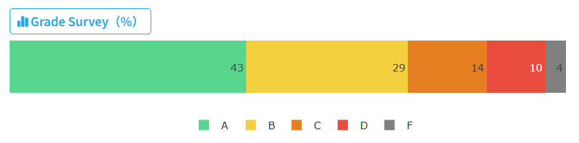

# 离散数学

大力推荐唐茗老师的离散数学！

这门课讲的东西很多，把数学的很多个模块缝合到一起，每个模块讲两三个星期，讲的很不深入（任何一个模块都能在数学系开一门课甚至几门课），因此难度不算大，但是经常在学习新东西接触新概念可能有些肝。本人是数学系的同学，这门课对于数学系应该是最简单的专业课了，难度略低于概统和 ODE，但对于计算机系的同学来说，还是需要认真一些多花时间的。至于给分，只能说唐茗老师很会送分，有各种 bonus，所以总体来说比陈杉老师的离散数学给分好，但唐茗老师的讲课水平也许还有待提升（

分数组成包括：

- 作业，6 次共 20 分，难度一般，好好写基本扣不了多少分（< 1 分）
- Quiz，2 次共 10 分，难度和作业差不多，基本也扣不了多少分（< 1 分）
- 考试，这门课的期中考试和期末考试分别是 30 分和 40 分，考试的卷面分是 110 分但满分是 100，多余的分数可以作为 bonus 计入总评，比如期中考试考 110 分相当于额外赚了 3 分总评
- Bonus Project，最高额外 5 分总评但最低会拿 -1 分，因此不要赶一个质量很差的交上去，根据某个题目写一篇论文，根据难度和创新性等指标评判得分。以往是选题随意，和离散数学相关就行，但这学期开始规定了一个选题列表共 10 个题目必须从这之中选择。
- Bonus Quiz，这是这学期新有的东西，最高额外 4 分总评，是在最后一节课一个半小时时间做去年的期末卷子，做对的越多得分越高。但相应的，由于多了这 4 分 bonus，期末考试的满分从 110 变成了 100，期中满分还是 110.

总评：99/100（这门课总评不给 100）

| 内容          | 得分 | 满分               | 占比         |
| ------------- | ---- | ------------------ | ------------ |
| 作业          | 19.6 | 20                 | 20%          |
| Quiz          | 9.4  | 10                 | 10%          |
| Bonus Quiz    | 3.65 | 4                  | 4% for bonus |
| Bonus Project | 0    | 5                  | 5% for bonus |
| 期中考试      | 110  | 110 (10 for bonus) | 30%          |
| 期末考试      | 89.4 | 100                | 40%          |
| 总计          | 100+ | 100                | 100%         |

离散数学 2024 春季成绩分布：

    

