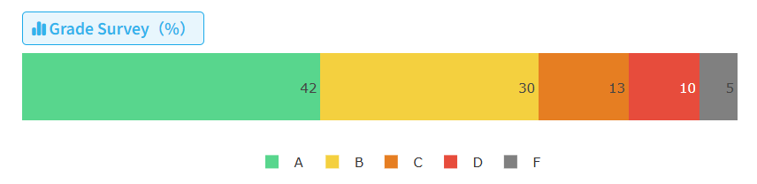

# 计算机组成原理

**一句话总结，这课我给好评！**

课程本身，确确实实学到了很多东西，收获很大；作业量不多，就是 Project 比较肝；白老师一直很好，讲课水平在你科已经很不错了；给分也还算不错，虽然期中考试有难度，但期末比较简单。（背景参考：本人数学系的，因为想学所以选了计组，也确实学到了很多东西，期中考的不错，期末因为不是专业课所以摆了没复习考的也不咋样，最后卡下绩 A+，体验还不错）

细化到大家最关心的分数分布上：

- 理论课作业 10 分：平时好好写基本没问题，作业题基本是课本上改个数（甚至不改），保险一点可以对着课本习题答案看看
- Lab课签到 5 分：别摆就很容易拿满
- 代码作业 10 分：两次，每次 3 题，都是写汇编，不算难
- Project 15 分：比较头疼，尽量尽早开始做，实在肝不出来可以放弃一部分扣一点分，毕竟整个 Project 只占 15
- 期中考试 30 分：期中难度较大，因为前半学期的东西确实干货更多比较重要，卷面平均分 70
- 期末考试 30 分：比期中简单，但可能考 ppt 上比较细节的概念性的东西，卷面平均分 80

最后是资源分享：

我们组的 Project 仓库，bonus 都拿满了，做了很多东西 (流水线，分支预测，异常控制，Cache，手搓了 Uart，还用汇编写了个小游戏能在 CPU 上跑，~~别的不说，我觉得我们文档还是写的挺好的~~) ：https://github.com/wLUOw/SUSTech_CS202_MineCPU

课程资料 (使用方式：Lab 签到如果懒得做了可以直接用，还有期中考卷子，作业题目可能每学期会变但也可以参考) ：https://github.com/wLUOw/CS_Notes

总评：97/100

| 内容       | 得分  | 满分 | 占比 |
| ---------- | ----- | ---- | ---- |
| 理论课作业 | 9.45  | 10   | 10%  |
| Lab课签到  | 5     | 5    | 5%   |
| Lab课作业  | 10    | 10   | 10%  |
| Project    | 118.5 | 100  | 15%  |
| 期中考试   | 96    | 100  | 30%  |
| 期末考试   | 86    | 100  | 30%  |
| 总计       | 97    | 100  | 100% |

计算机组成原理 2024 春季成绩分布：

    

