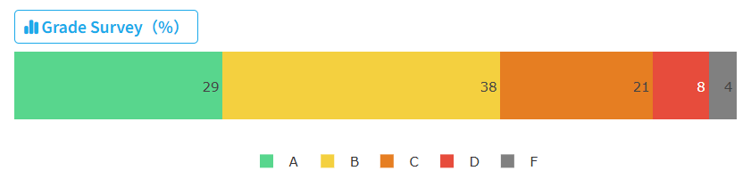

# 大数据导论与实践

这门课可以对标计系的机器学习，因此也可以称为数学系机器学习 ~~(如果想水选修学分，可以这两个都选，内容重合非常大)~~ 对于数学系来说应该不是太困难，对计系可能需要一些数学功底

总体体验本身还行，不能说非常好，~~但起码比计系那个机器学习要好~~；老师讲课中规中矩，但是人很好，有 Quiz 会提前在课程群里说，不会突击；作业不多，但是有一些难度；作为数学系课程，Project 比计系的要好办；没有期中考试，最后期末考试是最值得吐槽的地方 (见下)；给分上，我最后拿了 A，但总体给分也许不那么好

细说每个部分：

- 作业 30 分：共 5 次，难度不小，全是计算或证明的大题，但是貌似基本祖传，可以看上一届的作业
- Quiz 15 分：共 6 次，开卷可以看 ppt 和上网查，难度比作业小很多，但有选择和判断，考察对细节的掌握，不过好消息是 Quiz 的很多题目也祖传，可以参考上一届的
- Project 20 分：1 - 2 人做一个数据分析的 Project，难度不大，可卷可摆，没有非常明确的评分标准但给分都挺好的
- 期末考试 35 分：期末由判断题，选择题，简答题，大题组成，难度介于 Quiz 和作业之间。考法有一点怪，比较常规和基础的东西出小题，比较偏的知识点比如某算法的某一个变种反而出大题，可能大家考的都不怎么样，因为听到老师吐槽期末考的明明也不难怎么那么多不及格的，但最后也没捞。**值得注意的是，大题会出作业原题要仔细复习。**

最后是资料分享：

大数据导论课程资料：[链接](https://github.com/wLUOw/CS_Notes)

我们组的 Project 可参考：[链接](https://github.com/wLUOw/MA234_Course_Project)

数学系课程资料仓库：[链接](https://github.com/wLUOw/SUSTech_Math_Course_Materials)

总评：94/100

| 内容     | 得分  | 满分 | 占比 |
| -------- | ----- | ---- | ---- |
| 作业     | 30    | 30   | 30%  |
| Quiz     | 14.25 | 15   | 15%  |
| Project  | 19    | 20   | 20%  |
| 期末考试 | 88    | 100  | 35%  |
| 总计     | 94    | 100  | 100% |

大数据导论与实践 2024 春季成绩分布：

    

